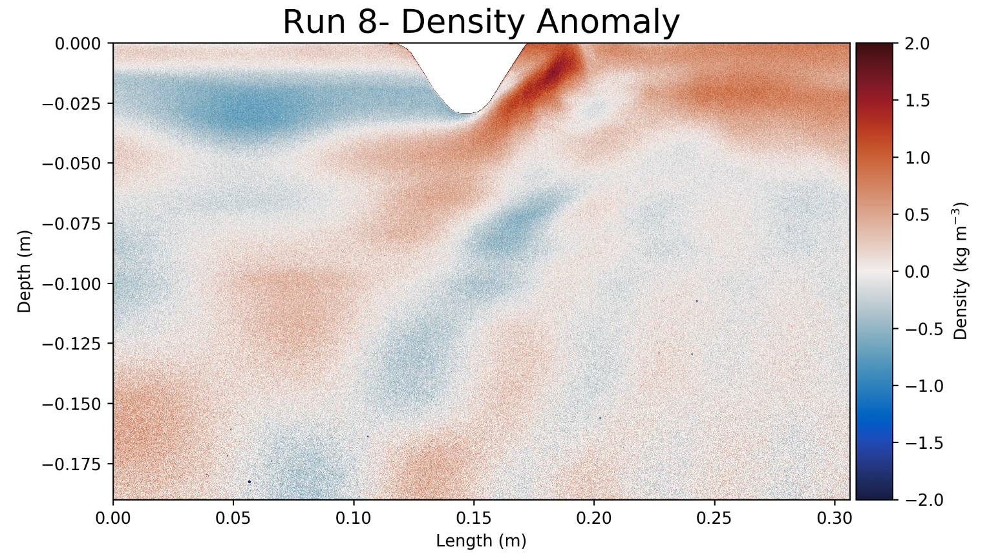

# Lab Ridge


This a repository of code for analysing lab work with a moving ridge conducted in 2019-2020 at ANU. The code contains some Python scripts and some outdated Jupyter notebooks that were abended for better parallelisation that is achieved with a standard python script (multiprocessing does not seem compatible with Jupyter). 

The code adapts the light attenuation technique used by Yvan Dossman to analyse density variations caused by a moving ridge (with both a tidal and mean flow component), in the large Perspex tank in the Geophysical Fluid Dynamics Laboratory at ANU.

## Installation

Currently the instialltion is very simplistic, download the repository and run the density_and_velocity.py program from the code folder. This will load in the analysis_functions.py as a module and use the functions contained within it. 

## Usage 

Running the analysis has been designed to be as straightfoward as possible. Just open the analysis_functions.py program. At the top of the program you will see:

```python
excel_path='E:/records.xlsx'
run = 8 
```

Enter the path to your excel document that contains all the infomation about the runs (density, water depth, etc.) and the experiment run number. After this then run the light_attenuation_analysis function. This function has a number of arguements:

```python
light_attenuation_analysis(run, excel_path, no_hills=1, sigma=0.005, moving_anom = 'no', moving_abs = 'no', fixed_anom = 'no', fixed_abs = 'no', w_vel = 'no', u_vel = 'no'): 
```
## Future Additions
