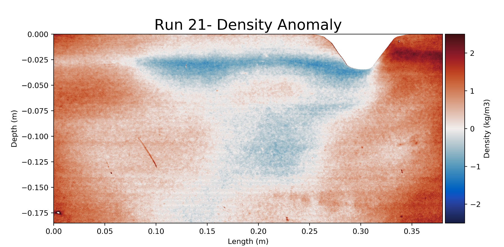

# Lab Ridge

This a repository of Python code for analysing lab work with a moving ridge conducted in 2019-2020 at ANU. There are currently a few Jupyter notebooks uploaded. The first- 'Main Routine' is for visualising, long term density vartions caused by the ridge. 

The second (and more complete) notebook allows for short term analysis of the density fields. It can create an mp4 of either density anomaly caused by the ridge or absolute density. These videos provide a quantative visulation of the density fields pertubed by both the lee waves and internal tides generated by the ridge. They also show features of local mixing- such as a vortex on the lee side of the ridge. This notebook is currently being expanded to allow for conversion between density (buoyancy) and velocity.

There are also a couple of notebooks uploaded where we have been trialing particle tracking. These are currently incomplete. 

Over the next week or so, I will uploaded/provide a link to the density videos produced by the code 
